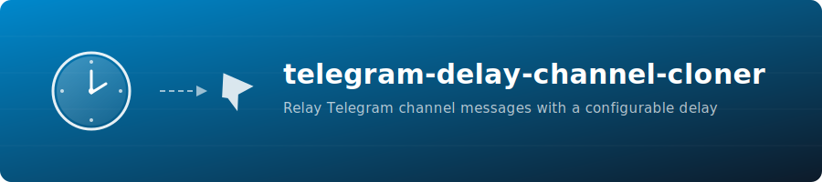

<p align="center">
  
</p>

<p align="center">
  <a href="https://github.com/GeiserX/telegram-delay-channel-cloner/actions"></a>
  <a href="https://hub.docker.com/r/drumsergio/telegram-delay-channel-cloner"></a>
  <a href="https://github.com/GeiserX/telegram-delay-channel-cloner/blob/main/LICENSE"></a>
  
</p>

---

A lightweight Telegram bot that relays messages from a source channel to a target channel after a configurable delay. Messages that are deleted or edited before the delay expires are handled gracefully -- deleted messages are never forwarded, and edits are picked up automatically. State is persisted in SQLite so nothing is lost across restarts.

## Features

- **Configurable delay** -- set any delay in seconds between receiving and forwarding a message.
- **Copy or forward** -- choose between copying (no "Forwarded from" header) or native forwarding.
- **Batch processing** -- processes messages in configurable batch sizes to handle bursts efficiently.
- **Deleted message handling** -- messages deleted from the source channel before the delay elapses are silently skipped.
- **Edited message handling** -- if a message is edited before being sent, the updated version is forwarded.
- **Retention cleanup** -- a daily job purges old database records after a configurable retention period.
- **SQLite persistence** -- all message state is stored on disk, surviving container restarts.
- **Lightweight** -- runs on `python:3.12-alpine` with minimal dependencies.

## Quick Start

### 1. Create a Telegram Bot

1. Open a conversation with [@BotFather](https://t.me/BotFather) on Telegram.
2. Send `/newbot` and follow the prompts to obtain your **Bot Token**.
3. Add the bot as an **administrator** to both the source and target channels.

### 2. Get Channel IDs

The easiest way is to forward a message from each channel to [@userinfobot](https://t.me/userinfobot) or use the Telegram API. Channel IDs are typically negative numbers (e.g., `-1001234567890`).

### 3. Deploy with Docker Compose

Create a `docker-compose.yml` file:

```yaml
services:
  channel-delay-cloner:
    image: drumsergio/telegram-delay-channel-cloner:0.0.1
    environment:
      BOT_TOKEN: "<your-bot-token>"
      SOURCE_CHANNEL: "<source-channel-id>"
      TARGET_CHANNEL: "<target-channel-id>"
      DELAY: 3600        # 1 hour
      POLLING: 30         # check every 30 seconds
    volumes:
      - messages_db:/data
    restart: unless-stopped

volumes:
  messages_db:
```

Then start it:

```bash
docker compose up -d
```

## Environment Variables

| Variable           | Description                                                        | Default            | Required |
|--------------------|--------------------------------------------------------------------|--------------------|----------|
| `BOT_TOKEN`        | Telegram Bot API token from BotFather                              | --                 | Yes      |
| `SOURCE_CHANNEL`   | Chat ID of the source channel                                      | --                 | Yes      |
| `TARGET_CHANNEL`   | Chat ID of the target channel                                      | --                 | Yes      |
| `DELAY`            | Delay in **seconds** before forwarding a message                   | `10`               | Yes      |
| `POLLING`          | Interval in **seconds** between batch processing runs              | `5`                | No       |
| `COPY_MESSAGE`     | `True` to copy (no forward header), `False` to forward natively    | `True`             | No       |
| `DB_LOCATION`      | Path to the SQLite database file inside the container              | `/data/messages.db`| No       |
| `RETENTION_PERIOD` | Number of **days** to keep processed message records               | `7`                | No       |
| `BATCH_SIZE`       | Maximum number of messages to process per polling cycle            | `10`               | No       |

## How It Works

```
Source Channel                          Target Channel
     |                                       ^
     |  new message                          |  copy/forward
     v                                       |
  [Bot receives message]                     |
     |                                       |
     +--> SQLite: store message_id     ------+
          with forward_time = now + DELAY
                    |
                    v
          [Polling job every N seconds]
          Selects messages where forward_time <= now
          Forwards batch, removes from DB
```

1. The bot listens for new posts in the source channel.
2. Each message is stored in SQLite with a `forward_time` set to `now + DELAY`.
3. A repeating job runs every `POLLING` seconds, selects messages whose delay has elapsed, and forwards them in batches of `BATCH_SIZE`.
4. If a message was deleted from the source before the delay expires, the Telegram API returns an error and the message is silently removed from the database.
5. A daily cleanup job at midnight removes records older than `RETENTION_PERIOD` days.

## Troubleshooting

| Symptom | Likely Cause | Fix |
|---------|-------------|-----|
| Bot does not forward anything | Bot is not an admin in both channels | Add the bot as administrator to source and target channels |
| `message_id_invalid` errors | Message was deleted from source before delay elapsed | Expected behavior -- the bot skips deleted messages automatically |
| Messages forwarded instantly | `DELAY` is set too low | Increase `DELAY` to the desired number of seconds |
| Database locked errors | Multiple instances writing to the same volume | Ensure only one container instance runs against each database file |
| Bot crashes on startup | Missing required environment variables | Verify `BOT_TOKEN`, `SOURCE_CHANNEL`, `TARGET_CHANNEL`, and `DELAY` are set |

## Building from Source

```bash
git clone https://github.com/GeiserX/telegram-delay-channel-cloner.git
cd telegram-delay-channel-cloner
docker build -t telegram-delay-channel-cloner .
```

## Maintainers

- [@GeiserX](https://github.com/GeiserX)

## Contributing

Contributions are welcome. [Open an issue](https://github.com/GeiserX/telegram-delay-channel-cloner/issues/new) or submit a pull request.

This project follows the [Contributor Covenant](http://contributor-covenant.org/version/2/1/) Code of Conduct.

## License

[MIT](LICENSE)
